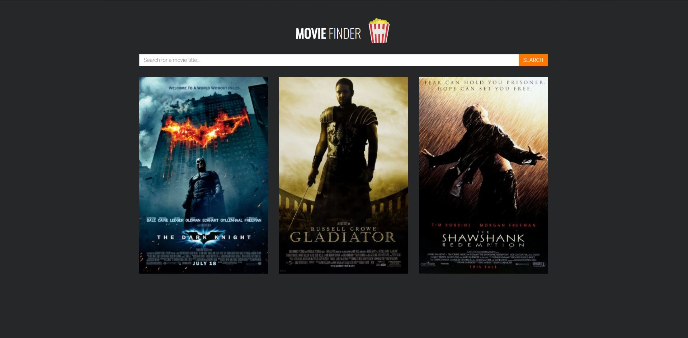
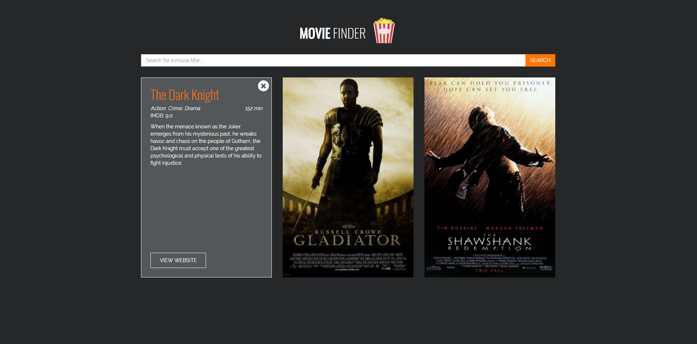

# movie-finder
This is a simple application I've developed in React JS that allows a user to search the [Open Movie Database API](http://www.omdbapi.com/). A user simply types in the name of a movie and the API returns the closest match. A user can then view basic information about the film such as the duration, the genre, a plot overview and its IMDB rating.

The site is available to view at https://moviefinder.tomsymonds.co.uk, or see below.

## Installation
Clone the repository and cd into the directory. Then execute `npm install` to install the dependencies.

Run `npm start` to run the app in development mode and open http://localhost:3000 to view in the browser. 

Alternatively run `npm run build` to build the app for production in the `build` folder.

The app utilises the [create react app](https://github.com/facebookincubator/create-react-app) package, so more information about the build commands is available in their readme.

## Preview
Below are a couple of screenshots for how the application looks.

First is a view of three movies that have been returned.

And when hovering over the film posters, basic movie information is displayed.

